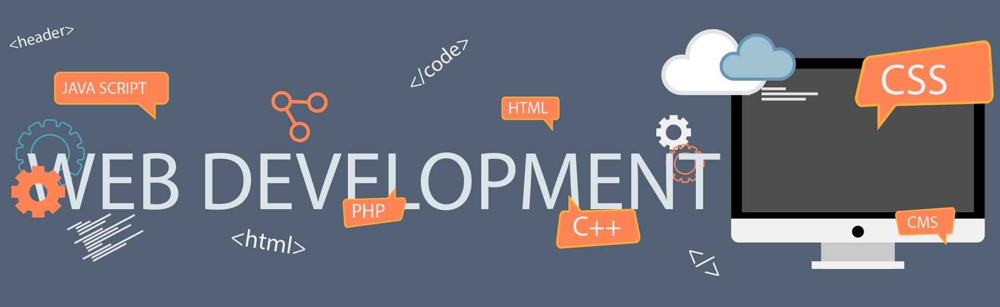

<!-- START HEADER - FULL WIDTH -->

  

<h1 align="center"> 
   
       
</h1> 
<!-- SOCIAL ICONS -->

  
  &nbsp;&nbsp;&nbsp;
  
  &nbsp;&nbsp;&nbsp;
  
  &nbsp;&nbsp;&nbsp;
  
  &nbsp;&nbsp;&nbsp;
   &nbsp;&nbsp;&nbsp
  

---

## 👨‍💻 About Me

Hi, I'm **Meher Kanti Sarkar** — a passionate technology enthusiast focused on building modern web applications, ERP solutions, and business automation systems.
I enjoy working on scalable software, solving real-world business problems, and learning new technologies that improve productivity and digital transformation.

### 🚀 What I Do

🌐 **Develop Full Stack Web Applications** &emsp; &nbsp; &nbsp; &nbsp; &nbsp; &nbsp; &nbsp;  🏢 **Build ERP & Payroll Management Systems**  
⚙️ **Create Business Automation Solutions** &emsp; &nbsp; &nbsp; &nbsp; &nbsp; &nbsp; &nbsp;  🗄️ **Design Database Architectures & Reports**  
🧩 **Customize Odoo & Laravel Applications** &emsp; &nbsp; &nbsp; &nbsp; &nbsp; &nbsp; &nbsp;  📊 **Work with APIs, Dashboards & Analytics**  

#### 🛠 Core Technologies

<strong>Backend :</strong>

<strong>Frontend :</strong>

<strong>Database :</strong>

<strong>ERP :</strong>

<strong>CMS :</strong>

<strong>Tools :</strong>

---

### 🌱 Currently Exploring

- Advanced Laravel Architecture
- ERP Workflow Optimization
- AI Integration in Business Systems
- Scalable System Design

### ⚡ Fun Fact

> I enjoy turning complex business processes into simple automated systems.

---
## 🏅 Certifications & Achievements

  
  
  
  
  
  
  

---
### 🏆 GitHub Achievements

  

### 📊 GitHub Statistics

  

---

<!-- FULL WIDTH FOOTER -->

  

